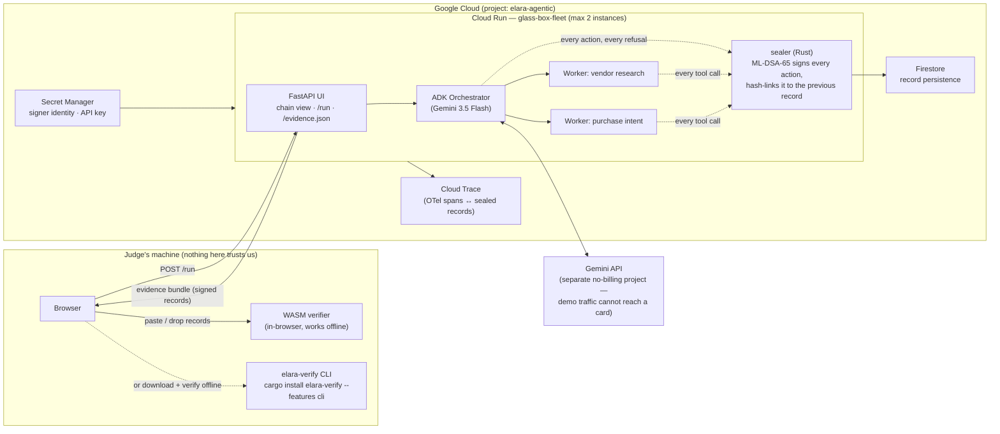

# Architecture — Glass-Box Fleet

The design goal: **a judge can verify every claim this demo makes without trusting the demo,
the entrant, or Google Cloud** — verification runs offline, on the judge's own machine.

## The trust boundary

Everything inside Google Cloud is **untrusted by design**. What crosses the boundary to the judge
is a bundle of signed records: each one binds the action's content hash and the previous record's
hash, signed with ML-DSA-65 (FIPS 204 lattice signatures, checked against NIST ACVP vectors in the
[elara-record](https://crates.io/crates/elara-record) test suite). Tamper with one byte anywhere —
an action's parameters, a timestamp, the order of events — and verification fails loudly, in the
judge's own browser, with the network tab closed.

Agent authority is scoped: the orchestrator carries a mandate with a spending cap, and an
over-limit purchase intent is **refused — and the refusal itself is sealed** as evidence. Audit
trails that only record successes are marketing; this one records what the fleet was *not allowed
to do*.

## Component inventory

| Piece | New for this hackathon | Pre-existing (disclosed) |
|---|---|---|
| ADK fleet, orchestration, tools | ✅ built during submission period | — |
| FastAPI UI + chain view | ✅ | — |
| sealer binary (Rust) | ✅ (new code) | depends on crates.io `elara-record 0.3.0` |
| Verification | — | `elara-verify 0.3.3` (crates.io) + WASM build, public since July 2026 |
| Cloud wiring (Run, Secret Manager, Trace, Firestore) | ✅ | — |
